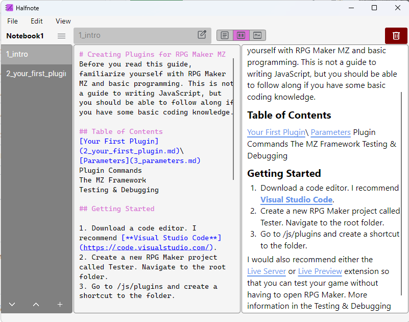
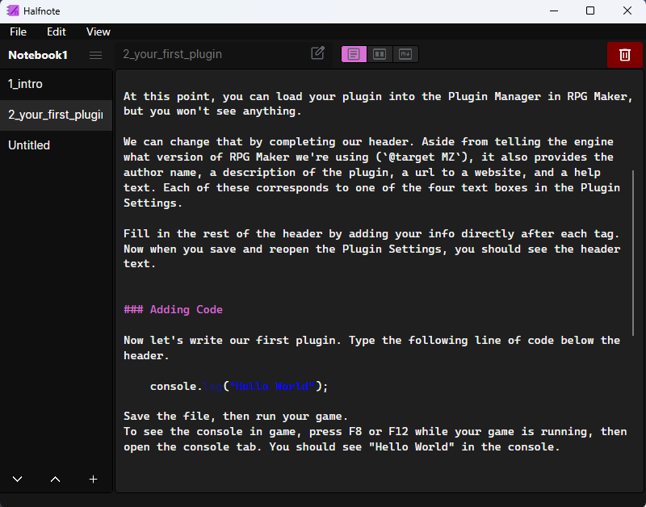

# Halfnote
Halfnote is a note-taking app written in C# Avalonia.

## Features
- Notebooks saved locally as folders
- Markdown syntax highlighting and preview
- Autosave
- Export to .txt or .md
- Light/Dark themes
- Cross-platform (Windows, Linux, MacOS)

## License
GPL-3.0